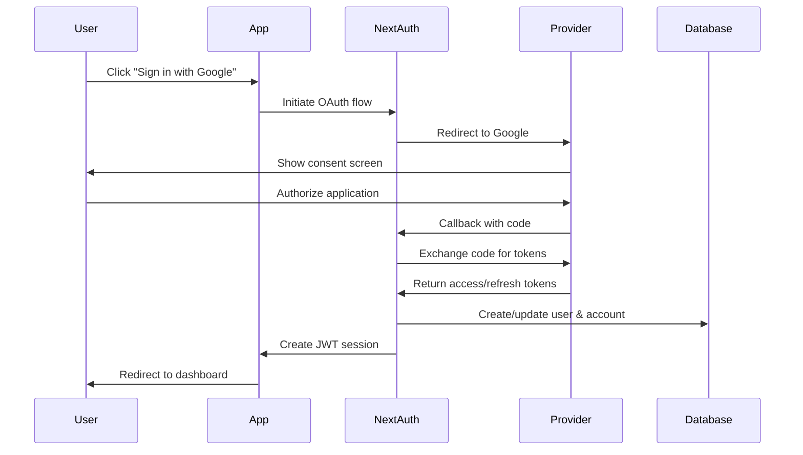

The Hack Western Platform implements authentication using NextAuth v4 with a JWT session strategy, supporting multiple OAuth providers and credential-based login.

## Authentication configuration

The NextAuth configuration is defined in `src/server/auth.ts:52-139`:

```typescript
export const authOptions: NextAuthOptions = {
  callbacks: {
    session: async ({ session, token }) => {
      if (session.user) {
        session.user.id = token.sub ?? "";
      }
      return session;
    },
    jwt: async ({ user, token }) => {
      if (user) {
        token.uid = user.id;
      }
      return token;
    },
    redirect: async ({ url, baseUrl }) => {
      if (url.startsWith("/")) return `${baseUrl}${url}`;
      else if (new URL(url).origin === baseUrl) return url;
      return baseUrl;
    },
  },
  session: {
    strategy: "jwt",
  },
  jwt: {
    encode,
    decode,
  },
  adapter: DrizzleAdapter(db, createTable) as Adapter,
  providers: [
    // ... providers
  ],
  pages: {
    signIn: "/login",
  },
};
```

## Session strategy

The platform uses **JWT sessions** instead of database sessions:

<CardGroup cols={2}>
  <Card title="Benefits" icon="check">
    - No database queries for session validation
    - Stateless authentication
    - Better scalability
    - Works with serverless deployments
  </Card>
  <Card title="Trade-offs" icon="circle-info">
    - Cannot invalidate sessions server-side
    - Token size limits
    - Requires secret rotation strategy
  </Card>
</CardGroup>

The JWT is stored in an HTTP-only cookie and contains the user ID. The session callback adds the user ID to the session object from `auth.ts:54-59`:

```typescript
session: async ({ session, token }) => {
  if (session.user) {
    session.user.id = token.sub ?? "";
  }
  return session;
}
```

## Database adapter

The Drizzle adapter integrates NextAuth with the database schema from `auth.ts:81`:

```typescript
adapter: DrizzleAdapter(db, createTable) as Adapter
```

This adapter:
- Creates user records on first sign-in
- Links OAuth accounts to user records
- Manages verification tokens
- Handles session persistence (when using database sessions)

The adapter uses these tables from the schema:
- `users` - User accounts
- `accounts` - OAuth provider connections
- `sessions` - Session tokens (not used with JWT strategy)
- `verificationTokens` - Email verification

## Authentication providers

### OAuth providers

Three OAuth providers are configured from `auth.ts:83-94`:

```typescript
GithubProvider({
  clientId: env.GITHUB_CLIENT_ID,
  clientSecret: env.GITHUB_CLIENT_SECRET,
}),
GoogleProvider({
  clientId: env.GOOGLE_CLIENT_ID,
  clientSecret: env.GOOGLE_CLIENT_SECRET,
}),
DiscordProvider({
  clientId: env.DISCORD_CLIENT_ID,
  clientSecret: env.DISCORD_CLIENT_SECRET,
})
```

#### OAuth flow



### Credentials provider

Email/password authentication for organizers and testing from `auth.ts:95-125`:

```typescript
CredentialsProvider({
  name: "Credentials",
  credentials: {
    username: { label: "Username", type: "text", placeholder: "Username" },
    password: {
      label: "Password",
      type: "password",
      placeholder: "Password",
    },
  },
  async authorize(credentials, _req) {
    if (!credentials) {
      return null;
    }
    const { username: email, password } = credentials;

    try {
      const result = await login(email, password);
      if (result.success) {
        return result.user;
      } else {
        return null;
      }
    } catch (error) {
      console.error("Login error", error);
      return null;
    }
  },
})
```

#### Credential login function

The `login` function validates credentials from `auth.ts:177-221`:

```typescript
async function login(email: string, password: string) {
  try {
    // Find user by email
    const user = await db.query.users.findFirst({
      where: (users, { eq }) => eq(users.email, email),
    });

    if (!user) {
      throw new TRPCError({
        code: "NOT_FOUND",
        message: "User not found",
      });
    }

    if (!user.password) {
      throw new TRPCError({
        code: "INTERNAL_SERVER_ERROR",
        message: "Password not set",
      });
    }

    // Verify password with bcrypt
    const passwordMatch = await bcrypt.compare(password, user.password);

    if (!passwordMatch) {
      throw new TRPCError({
        code: "UNAUTHORIZED",
        message: "Invalid password",
      });
    }

    return {
      success: true,
      user: {
        id: user.id,
        email: user.email,
      },
    };
  } catch (error) {
    throw error instanceof TRPCError
      ? error
      : new TRPCError({
          code: "INTERNAL_SERVER_ERROR",
          message: "Failed to login" + JSON.stringify(error),
        });
  }
}
```

Passwords are hashed with bcrypt before storage and verified using constant-time comparison.

## Session access

### Server-side

Access the session in API routes and server-side code using `getServerAuthSession` from `auth.ts:146-151`:

```typescript
export const getServerAuthSession = (ctx: {
  req: GetServerSidePropsContext["req"];
  res: GetServerSidePropsContext["res"];
}) => {
  return getServerSession(ctx.req, ctx.res, authOptions);
};
```

Usage in pages:
```typescript
export async function getServerSideProps(ctx) {
  const session = await getServerAuthSession(ctx);
  if (!session) {
    return { redirect: { destination: "/login", permanent: false } };
  }
  return { props: { session } };
}
```

### tRPC context

The session is automatically added to the tRPC context from `src/server/api/trpc.ts:54-63`:

```typescript
export const createTRPCContext = async (opts: CreateNextContextOptions) => {
  const { req, res } = opts;
  const session = await getServerAuthSession({ req, res });
  return createInnerTRPCContext({ session });
};
```

### Client-side

Use NextAuth's React hooks:

```typescript
import { useSession } from "next-auth/react";

export function Component() {
  const { data: session, status } = useSession();
  
  if (status === "loading") return <div>Loading...</div>;
  if (status === "unauthenticated") return <div>Not signed in</div>;
  
  return <div>Welcome {session.user.name}</div>;
}
```

## Protected procedures

The platform defines three levels of access control in tRPC:

### Public procedure

From `trpc.ts:115`:
```typescript
export const publicProcedure = t.procedure;
```

No authentication required. Used for login, registration, and landing pages.

### Protected procedure

From `trpc.ts:125-135`:
```typescript
export const protectedProcedure = t.procedure.use(({ ctx, next }) => {
  if (!ctx.session || !ctx.session.user) {
    throw new TRPCError({ code: "UNAUTHORIZED" });
  }
  return next({
    ctx: {
      session: { ...ctx.session, user: ctx.session.user },
    },
  });
});
```

Requires authenticated user. Used for hacker dashboard and application submission.

### Protected organizer procedure

From `trpc.ts:137-158`:
```typescript
export const protectedOrganizerProcedure = protectedProcedure.use(
  async ({ ctx, next }) => {
    const userId = ctx.session.user.id;

    const dbUser = await db.query.users.findFirst({
      where: eq(users.id, userId),
    });

    if (!dbUser || dbUser.type !== "organizer") {
      throw new TRPCError({
        code: "FORBIDDEN",
        message: "User is not an organizer",
      });
    }

    return next({
      ctx: {
        session: { ...ctx.session, user: ctx.session.user },
      },
    });
  },
);
```

Requires organizer role. Used for application review and admin features.

## Type safety

NextAuth types are extended via module augmentation from `auth.ts:32-45`:

```typescript
declare module "next-auth" {
  interface Session extends DefaultSession {
    user: {
      id: string;
    } & DefaultSession["user"];
  }
}
```

This ensures the user ID is always available in session objects with full TypeScript support.

## Custom login page

The platform uses a custom login page instead of NextAuth's default from `auth.ts:136-138`:

```typescript
pages: {
  signIn: "/login",
}
```

This allows for:
- Custom branding and styling
- Integrated registration flow
- Application-specific UI/UX

## Password reset

The schema includes a `resetPasswordTokens` table for password reset functionality:

```typescript
export const resetPasswordTokens = createTable("reset_password_token", {
  userId: varchar("userId", { length: 255 })
    .references(() => users.id)
    .primaryKey(),
  token: varchar("token", { length: 255 }),
  expires: timestamp("expires", { mode: "date" }).notNull(),
});
```

Password reset flow:
1. User requests reset via email
2. Token generated and stored in database
3. Email sent with reset link
4. User visits link and enters new password
5. Password hashed with bcrypt and updated
6. Token deleted from database

## Security considerations

<CardGroup cols={2}>
  <Card title="Password hashing" icon="lock">
    Bcrypt with automatic salt generation for credential passwords
  </Card>
  <Card title="HTTP-only cookies" icon="cookie">
    JWT stored in HTTP-only cookies to prevent XSS attacks
  </Card>
  <Card title="CSRF protection" icon="shield">
    NextAuth includes built-in CSRF token validation
  </Card>
  <Card title="Token rotation" icon="rotate">
    OAuth refresh tokens stored securely in database
  </Card>
</CardGroup>

## Testing utilities

Mock session helpers for testing from `auth.ts:153-175`:

```typescript
export async function mockSession(db: Database): Promise<Session> {
  const user = new UserSeeder().createRandom();
  await db.insert(users).values(user).returning();
  return {
    user,
    expires: new Date(Date.now() + 10).toISOString(),
  };
}

export async function mockOrganizerSession(db: Database): Promise<Session> {
  const user = {
    ...new UserSeeder().createRandom(),
    type: "organizer",
  } as const satisfies PgInsertValue<typeof users>;
  await db.insert(users).values(user).returning();
  return {
    user,
    expires: new Date(Date.now() + 10).toISOString(),
  };
}
```

These create temporary users for testing protected and organizer procedures.