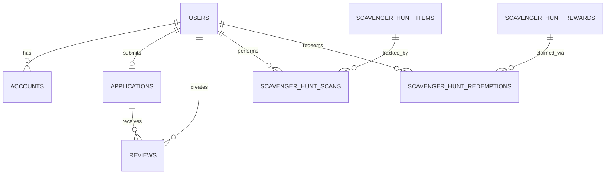

The Hack Western Platform uses PostgreSQL with Drizzle ORM for type-safe database operations. The schema is defined in `src/server/db/schema.ts` and uses a table prefix system for multi-year support.

## Table prefix system

From `schema.ts:26-34`:

```typescript
const TABLE_PREFIX = "hw";

export const createTable = pgTableCreator((name) => `${TABLE_PREFIX}_${name}`);
```

All tables are prefixed with `hw_` (e.g., `hw_user`, `hw_application`). This allows multiple hackathon years to coexist in the same database by changing the prefix annually.

## Core tables

### Users

The central table for all platform users from `schema.ts:349-369`:

```typescript
export const users = createTable(
  "user",
  {
    id: varchar("id", { length: 255 }).notNull().primaryKey(),
    name: varchar("name", { length: 255 }),
    password: varchar("password", { length: 255 }),
    email: varchar("email", { length: 255 }).notNull(),
    emailVerified: timestamp("emailVerified", { mode: "date" })
      .default(sql`CURRENT_TIMESTAMP`),
    image: varchar("image", { length: 255 }),
    type: userType("type").default("hacker"),
    scavengerHuntEarned: integer("scavenger_hunt_earned").default(0),
    scavengerHuntBalance: integer("scavenger_hunt_balance").default(0),
  },
  // Indexes for scavenger hunt leaderboard queries
);
```

**User types** (`schema.ts:347`):
- `hacker` - Regular attendee
- `organizer` - Event organizer with admin access
- `sponsor` - Sponsor representative

**Relations** (`schema.ts:371-374`):
```typescript
export const usersRelations = relations(users, ({ one, many }) => ({
  accounts: many(accounts),      // OAuth accounts
  application: one(applications), // Hacker application
}));
```

### Applications

Hacker applications with multi-step form data from `schema.ts:239-325`:

```typescript
export const applications = createTable(
  "application",
  {
    userId: varchar("user_id", { length: 255 })
      .notNull()
      .primaryKey()
      .references(() => users.id, { onDelete: "cascade" }),
    createdAt: timestamp("created_at", { mode: "date", precision: 3 })
      .defaultNow()
      .notNull(),
    updatedAt: timestamp("updated_at", { mode: "date", precision: 3 })
      .defaultNow()
      .notNull(),
    status: applicationStatus("status").default("IN_PROGRESS").notNull(),
    
    // Avatar customization
    avatarColour: avatarColour("avatar_colour"),
    avatarFace: integer("avatar_face"),
    avatarLeftHand: integer("avatar_left_hand"),
    avatarRightHand: integer("avatar_right_hand"),
    avatarHat: integer("avatar_hat"),
    
    // Personal information
    firstName: varchar("first_name", { length: 255 }),
    lastName: varchar("last_name", { length: 255 }),
    age: integer("age"),
    phoneNumber: varchar("phone_number", { length: 42 }),
    countryOfResidence: countrySelection("country_of_residence"),
    
    // Academic information
    school: varchar("name", { length: 255 }),
    levelOfStudy: levelOfStudy("level_of_study"),
    major: major("major"),
    
    // Experience
    attendedBefore: boolean("attended"),
    numOfHackathons: numOfHackathons("num_of_hackathons"),
    
    // Essay questions
    question1: text("question1"),
    question2: text("question2"),
    question3: text("question3"),
    
    // Profile links
    resumeLink: varchar("resume_link", { length: 2048 }),
    githubLink: varchar("github_link", { length: 2048 }),
    linkedInLink: varchar("linkedin_link", { length: 2048 }),
    otherLink: varchar("other_link", { length: 2048 }),
    
    // Required agreements
    agreeCodeOfConduct: boolean("agree_code_of_conduct").default(false).notNull(),
    agreeShareWithMLH: boolean("agree_share_with_mlh").default(false).notNull(),
    agreeWillBe18: boolean("agree_will_be_18").default(false).notNull(),
    
    // Optional agreements
    agreeShareWithSponsors: boolean("agree_share_with_sponsors").default(false).notNull(),
    agreeEmailsFromMLH: boolean("agree_emails_from_mlh").default(false).notNull(),
    
    // Optional demographic data
    underrepGroup: boolean("underrep_group"),
    gender: gender("gender"),
    ethnicity: ethnicity("ethnicity"),
    sexualOrientation: sexualOrientation("sexual_orientation"),
    
    // Canvas drawing data
    canvasData: jsonb("canvas_data")
      .$type<{ paths: CanvasPaths; timestamp: number; version: string }>()
      .default(sql`'{"paths":[],"timestamp":0,"version":""}'::jsonb`)
      .notNull(),
  },
);
```

**Application status** (`schema.ts:39-47`):
```typescript
export const applicationStatus = pgEnum("application_status", [
  "IN_PROGRESS",     // User is filling out the form
  "PENDING_REVIEW",  // Submitted, waiting for review
  "IN_REVIEW",       // Being reviewed by organizers
  "ACCEPTED",        // Accepted to attend
  "REJECTED",        // Not accepted
  "WAITLISTED",      // On waitlist
  "DECLINED",        // User declined acceptance
]);
```

**Relations** (`schema.ts:336-345`):
```typescript
export const applicationsRelations = relations(
  applications,
  ({ one, many }) => ({
    user: one(users, {
      fields: [applications.userId],
      references: [users.id],
    }),
    reviews: many(reviews),
  }),
);
```

### Reviews

Organizer reviews of applications from `schema.ts:174-211`:

```typescript
export const reviews = createTable(
  "review",
  {
    reviewerUserId: varchar("reviewer_user_id", { length: 255 })
      .notNull()
      .references(() => users.id),
    applicantUserId: varchar("applicant_user_id", { length: 255 })
      .notNull()
      .references(() => applications.userId)
      .references(() => users.id),
    createdAt: timestamp("created_at", { mode: "date", precision: 3 })
      .defaultNow()
      .notNull(),
    updatedAt: timestamp("updated_at", { mode: "date", precision: 3 })
      .defaultNow()
      .notNull(),
    originalityRating: smallint("originality_rating").default(0),
    technicalityRating: smallint("technicality_rating").default(0),
    passionRating: smallint("passion_rating").default(0),
    comments: text("comments"),
    completed: boolean("completed").default(false),
    referral: boolean("referral").default(false),
  },
  (review) => ({
    pk: primaryKey({
      columns: [review.reviewerUserId, review.applicantUserId],
    }),
    applicantIdx: index("applicant_user_id_idx").on(review.applicantUserId),
  }),
);
```

Composite primary key ensures one review per organizer per application.

**Relations** (`schema.ts:220-233`):
```typescript
export const reviewsRelations = relations(reviews, ({ one }) => ({
  reviewer: one(users, {
    fields: [reviews.reviewerUserId],
    references: [users.id],
  }),
  applicant: one(users, {
    fields: [reviews.applicantUserId],
    references: [users.id],
  }),
  application: one(applications, {
    fields: [reviews.applicantUserId],
    references: [applications.userId],
  }),
}));
```

## Authentication tables

### Accounts

OAuth provider accounts from `schema.ts:376-401`:

```typescript
export const accounts = createTable(
  "account",
  {
    userId: varchar("userId", { length: 255 })
      .notNull()
      .references(() => users.id),
    type: varchar("type", { length: 255 })
      .$type<AdapterAccount["type"]>()
      .notNull(),
    provider: varchar("provider", { length: 255 }).notNull(),
    providerAccountId: varchar("providerAccountId", { length: 255 }).notNull(),
    refresh_token: text("refresh_token"),
    access_token: text("access_token"),
    expires_at: integer("expires_at"),
    token_type: varchar("token_type", { length: 255 }),
    scope: varchar("scope", { length: 255 }),
    id_token: text("id_token"),
    session_state: varchar("session_state", { length: 255 }),
  },
  (account) => [
    primaryKey({ columns: [account.provider, account.providerAccountId] }),
    index("account_userId_idx").on(account.userId),
  ],
);
```

Stores OAuth tokens for Google, GitHub, and Discord providers.

### Sessions

Session tokens from `schema.ts:407-421`:

```typescript
export const sessions = createTable(
  "session",
  {
    sessionToken: varchar("sessionToken", { length: 255 })
      .notNull()
      .primaryKey(),
    userId: varchar("userId", { length: 255 })
      .notNull()
      .references(() => users.id),
    expires: timestamp("expires", { mode: "date" }).notNull(),
  },
  (session) => ({
    userIdIdx: index("session_userId_idx").on(session.userId),
  }),
);
```

### Verification tokens

Email verification from `schema.ts:427-435`:

```typescript
export const verificationTokens = createTable(
  "verification_token",
  {
    identifier: varchar("identifier", { length: 255 }).notNull(),
    token: varchar("token", { length: 255 }).notNull(),
    expires: timestamp("expires", { mode: "date" }).notNull(),
  },
  (vt) => [primaryKey({ columns: [vt.identifier, vt.token] })],
);
```

### Password reset tokens

From `schema.ts:437-443`:

```typescript
export const resetPasswordTokens = createTable("reset_password_token", {
  userId: varchar("userId", { length: 255 })
    .references(() => users.id)
    .primaryKey(),
  token: varchar("token", { length: 255 }),
  expires: timestamp("expires", { mode: "date" }).notNull(),
});
```

## Scavenger hunt system

### Items

QR code items to scan from `schema.ts:445-451`:

```typescript
export const scavengerHuntItems = createTable("scavenger_hunt_item", {
  id: serial("id").primaryKey(),
  code: varchar("code", { length: 12 }).unique().notNull(),
  points: smallint("points").default(1).notNull(),
  description: text("description"),
  deletedAt: timestamp("deleted_at", { mode: "date", precision: 3 }),
});
```

### Scans

User scans of items from `schema.ts:453-474`:

```typescript
export const scavengerHuntScans = createTable(
  "scavenger_hunt_scan",
  {
    userId: varchar("user_id", { length: 255 })
      .notNull()
      .references(() => users.id),
    scannerId: varchar("scanner_id", { length: 255 })
      .notNull()
      .references(() => users.id),
    itemId: integer("item_id")
      .notNull()
      .references(() => scavengerHuntItems.id),
    createdAt: timestamp("created_at", { mode: "date", precision: 3 })
      .defaultNow()
      .notNull(),
  },
  (t) => [
    primaryKey({ columns: [t.userId, t.itemId] }),
    index("scan_user_idx").on(t.userId),
    index("scan_scanner_idx").on(t.scannerId),
  ],
);
```

Composite primary key prevents duplicate scans of the same item.

### Rewards

Redeemable prizes from `schema.ts:476-482`:

```typescript
export const scavengerHuntRewards = createTable("scavenger_hunt_reward", {
  id: serial("id").primaryKey(),
  name: varchar("name", { length: 255 }).notNull(),
  costPoints: smallint("cost_points").notNull(),
  description: text("description"),
  quantity: integer("quantity"),
});
```

### Redemptions

User reward redemptions from `schema.ts:484-499`:

```typescript
export const scavengerHuntRedemptions = createTable(
  "scavenger_hunt_redemption",
  {
    id: serial("id").primaryKey(),
    userId: varchar("user_id", { length: 255 })
      .notNull()
      .references(() => users.id),
    rewardId: integer("reward_id")
      .notNull()
      .references(() => scavengerHuntRewards.id),
    createdAt: timestamp("created_at", { mode: "date", precision: 3 })
      .defaultNow()
      .notNull(),
  },
  (t) => [index("redemption_user_idx").on(t.userId)],
);
```

## Preregistration

Email collection before applications open from `schema.ts:159-168`:

```typescript
export const preregistrations = createTable("preregistration", {
  id: serial("id").primaryKey(),
  createdAt: timestamp("created_at", { mode: "date", precision: 3 })
    .defaultNow()
    .notNull(),
  email: varchar("email", { length: 320 }).unique().notNull(),
});
```

## Enums

The schema defines several PostgreSQL enums for structured data:

<CardGroup cols={2}>
  <Card title="Application data" icon="file-lines">
    - `applicationStatus` - Application workflow states
    - `avatarColour` - Avatar customization colors
    - `levelOfStudy` - Education level
    - `major` - Field of study
    - `numOfHackathons` - Prior experience
  </Card>
  <Card title="Demographics" icon="users">
    - `gender` - Gender identity
    - `ethnicity` - Race/ethnicity
    - `sexualOrientation` - Sexual orientation
    - `countrySelection` - Country of residence
  </Card>
</CardGroup>

## Entity relationships



## Indexes

The schema includes strategic indexes for common queries:

- `user_id_idx` on applications
- `applicant_user_id_idx` on reviews
- `account_userId_idx` on accounts
- `session_userId_idx` on sessions
- `user_scavenger_hunt_earned_idx` and `user_scavenger_hunt_balance_idx` for leaderboards
- `scan_user_idx` and `scan_scanner_idx` for scavenger hunt tracking
- `redemption_user_idx` for reward history

## Migration workflow

From `package.json:11-13`:

```bash
# Generate migration files from schema changes
npm run db:generate

# Apply migrations to database
npm run db:migrate

# Seed database with test data
npm run db:seed
```