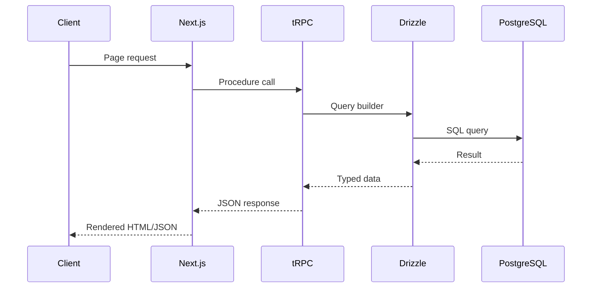

The Hack Western Platform is a full-stack hackathon management system built with modern web technologies. The architecture follows the T3 Stack pattern, combining Next.js, tRPC, and Drizzle ORM to create a type-safe, end-to-end TypeScript application.

## Architecture layers

The platform is organized into three main architectural layers:

<CardGroup cols={3}>
  <Card title="Frontend" icon="browser">
    Next.js 15 with React 19, using the Pages Router pattern for server-side rendering and client-side navigation
  </Card>
  <Card title="API layer" icon="link">
    tRPC for type-safe API calls between client and server, eliminating the need for REST or GraphQL
  </Card>
  <Card title="Data layer" icon="database">
    Drizzle ORM with PostgreSQL for type-safe database queries and migrations
  </Card>
</CardGroup>

## Request flow

A typical request flows through the system as follows:



## Core technologies

### Next.js app configuration

The platform uses Next.js 15 with the following configuration:

```javascript
const config = {
  reactStrictMode: true,
  experimental: {
    reactCompiler: true,
  },
  i18n: {
    locales: ["en"],
    defaultLocale: "en",
  },
};
```

Key features:
- **React Compiler**: Experimental React 19 compiler for optimized rendering
- **Pages Router**: Traditional Next.js routing with `pages/` directory
- **i18n support**: Configured for English locale with extensibility for multiple languages

### tRPC configuration

The tRPC setup provides end-to-end type safety from `src/server/api/trpc.ts:73-85`:

```typescript
const t = initTRPC.context<typeof createTRPCContext>().create({
  transformer: superjson,
  errorFormatter({ shape, error }) {
    return {
      ...shape,
      data: {
        ...shape.data,
        zodError:
          error.cause instanceof ZodError ? error.cause.flatten() : null,
      },
    };
  },
});
```

This configuration:
- Uses **SuperJSON** for serializing complex types (Dates, Maps, Sets)
- Includes **Zod error formatting** for validation errors
- Maintains full type safety across the client-server boundary

### Database architecture

Drizzle ORM connects to PostgreSQL and uses a table prefix system for multi-year support:

```typescript
const TABLE_PREFIX = "hw";
export const createTable = pgTableCreator((name) => `${TABLE_PREFIX}_${name}`);
```

This allows multiple hackathon years to coexist in the same database by changing the prefix annually.

## Authentication flow

Authentication is handled by NextAuth v4 with JWT session strategy:

1. User signs in via OAuth provider (Google, GitHub, Discord) or credentials
2. NextAuth creates a JWT token stored in HTTP-only cookies
3. tRPC middleware validates the session on protected procedures
4. User session data is available in all tRPC contexts

See the [authentication documentation](/architecture/authentication) for implementation details.

## Procedure types

The platform defines three types of tRPC procedures from `src/server/api/trpc.ts:115-158`:

<CardGroup cols={3}>
  <Card title="Public" icon="globe">
    No authentication required. Used for landing pages, login, and registration.
  </Card>
  <Card title="Protected" icon="lock">
    Requires authenticated user session. Used for hacker dashboard and applications.
  </Card>
  <Card title="Organizer" icon="shield">
    Requires organizer role. Used for application review and admin features.
  </Card>
</CardGroup>

## Development environment

The platform includes comprehensive development tooling:

- **Turbopack**: Fast bundling for development (`next dev --turbopack`)
- **Drizzle Studio**: Visual database browser (`npm run db:studio`)
- **Type checking**: Full TypeScript with strict mode
- **Database migrations**: Automatic schema generation and migration
- **Seeding**: Faker-based data generation for testing

## Project structure

```
src/
├── pages/              # Next.js pages and API routes
├── server/
│   ├── api/           # tRPC routers and procedures
│   │   └── trpc.ts    # tRPC initialization
│   ├── auth.ts        # NextAuth configuration
│   └── db/
│       ├── schema.ts  # Drizzle schema definitions
│       └── migrate.ts # Migration runner
├── components/        # React components
└── env.js            # Environment variable validation
```

Each layer is strictly typed with TypeScript, ensuring compile-time safety across the entire stack.